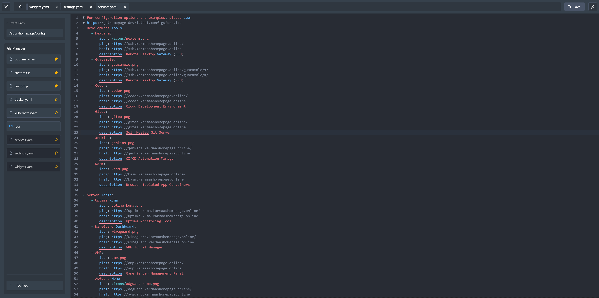

# Repo Stats


<a href="https://discord.gg/jv4u9wJp"></a>
#### Top Technologies
[](#)
[](#)
[](#)
[](#)
[](#)
[](#)
[](#)
[](#)


<br />
<p align="center">
  <a href="https://github.com/LukeGus/Confix">
      </a>
</p>

If you would like, you can support the project here!\
[](https://paypal.me/LukeGustafson803)

# Overview
Confix is an open-source forever free self-hosted local config editor. Its purpose is to provide an all-in-one docker-hosted web solution to manage your servers config files, without having to enter SSH and use a tedious tool such as `nano`.



# Features
- Interactive text editor ([CodeMirror](https://uiwjs.github.io/react-codemirror/#/))
  - Features syntax highlighting, formatting, linting, styling, searching, etc.
- User authentication/management system
- Built in file viewer for navigating your file system
- Tab system to navigate between open config files
- Seamlessly pick up where you left off with features that save your open tabs, track recently accessed files, let you star important config files, and quickly return to your saved directories.

# Planned Features
- Custom themes
- Better syntax highlighting depending on config language
- Guest mode
- User permissions (only some users can open certain files/folders, etc.)

# Installation
Visit the Confix [Wiki](https://github.com/LukeGus/Confix/wiki) for information on how to install Confix. You can also use these links to go directly to guide: [Docker](https://github.com/LukeGus/Confix/wiki/Docker) or [manual install](https://github.com/LukeGus/Confix/wiki/Manual).

Example docker compose:
```yaml
services:
  confix:
    image: ghcr.io/lukegus/confix:latest
    container_name: confix
    restart: unless-stopped
    ports:
      - "8080:8080"
    volumes:
      - confix-data:/app/src/backend
      # Add volume mappings for your configuration directories below.
      # Example: - /apps/:/apps  
      # (Left side: path on your server, Right side: path as accessed inside the Confix file browser)
    environment:
      # Generate random salt here https://www.lastpass.com/features/password-generator (max 32 characters, include all characters for settings)
      SALT: "2v.F7!6a!jIzmJsu|[)h61$ZMXs;,i+~"
      PORT: "8080"

volumes:
  confix-data:
    driver: local
```

# Support
If you need help with Confix, you can join the [Discord](https://discord.gg/jVQGdvHDrf) server and visit the support channel. You can also open an issue or open a pull request on the [GitHub](https://github.com/LukeGus/Confix/pulls) repo. If you would like to support me financially, you can on [Paypal](https://paypal.me/LukeGustafson803).

# Show-off


# License
Distributed under the MIT license. See LICENSE for more information.